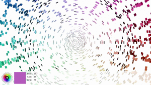
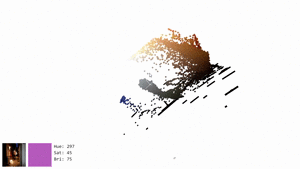

3D HSV Viewer
====

This program can show picture's HSV data in 3D view.

## Demo

## Requirement

* [Processing](https://processing.org/)
* PeasyCam
  * Please install it from `Sketch -> Import library... -> Add library... -> Contribution Manager` in Processing IDE.

## Contoll

* Mouse D&D
  * Move camera.
* click
  * Pick a color under the cursor.
* `q` key
  * Hisogram based view: ON/OFF
  * If ON, size of each HSV data depends on itself number of occurrences.
* `e` key
  * Toggle background color: White or Black
* `c` key
  * Toggle color clip: Show/Hide White and Black pixel
  * **NOTE**: This function is acting very sluggish.
* `d` key
  * Switch to next image.
* `a` key
  * Switch to previous image.

## Usage

* Locate your picture into `img` directory.

## NOTE

* The image file needs to be resized.  
* DO NOT place Non-image file in `img` directory.